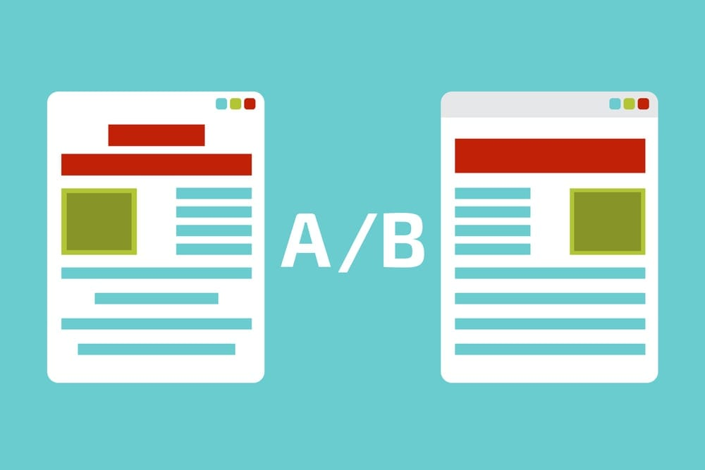
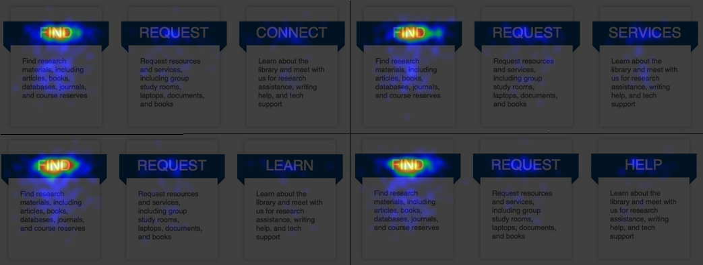

# Teste A/B/n - Taxa de Clicks no site

# Introdução

Esse é um projeto end-to-end de Data Science, focado na especilização com Teste A/B. No qual identificamos qual é melhor variante do site trouxe mais clicks para o ponto específico da página, e mostramos a importância de aplicar esse tipo de teste e suas diferentes vertentes.

Os dados podem ser encontrados nesse repositório.

Esse projeto faz parte da "Comunidade DS", que é um ambiente de estudo que promove o aprendizado, execução, e discussão de projetos de Data Science.

### Plano de Desenvolvimento do Projeto de Data Science

Esse projeto foi desenvolvido seguindo o método CRISP-DS(Cross-Industry Standard Process - Data Science). Essa é uma metodologia capaz de transformar os dados da empresa em conhecimento e informações que auxiliam na tomada de decisão. A metodologia CRISP-DM define o ciclo de vida do projeto, dividindo-as nas seguintes etapas:

- Entendimento do Problema de Negócio
- Coleção dos Dados
- Limpeza de Dados
- Análise Exploratória dos Dados
- Preparação dos Dados
- Modelos de Machine Learning.
- Avaliação dos Resultados do Modelo e Tradução para Negócio.
- Modelo em Produção

Observação: Como esse não é um projeto com uso de Machine Learning, os ciclos do CRISP-DM foram usados no contexto do Teste A/B/n.

### Planejamento

- [1. Descrição e Problema de Negócio](#1-descrição-e-problema-de-negócio)
- [2. Base de Dados e Premissas de Negócio](#2-base-de-dados-e-premissas-de-negócio)
- [3. Estratégia de Solução](#3-estratégia-de-solução)
- [4. Definição dos Parâmetros](#4-definição-dos-parâmetros)
- [5. Teste de Hipóteses](#5-teste-de-hipóteses)
- [6. Post Hoc Testing](#6-post-hoc-testing)
- [7. Resultados de Negócio](#7-resultados-de-negócio)
- [8. Conclusão](#8-conclusão)
- [9. Aprendizados e Trabalhos Futuros](#9-aprendizados-e-trabalhos-futuros)

# 1. Descrição e Problema de Negócio

### 1.1 Descrição

A universidade de Montada, nos Estados Unidos, possui vários serviços de apoio ao aluno, incluindo um biblioteca.

A biblioteca da universidade oferece vários serviços para os estudantes, como alocação de salas de estudos, livros, computadores, discussões em grupo, webnários e etc. Todos esses serviços e vários outros, ficam disponíveis dentro da página web da própria biblioteca e os alunos podem acessá-la para agendar algum dos serviços disponíveis.

A página possuí um banner da universidade, uma barra de busca, três principais categorias de acesso e um barra lateral direita que exibi as últimas notícias.

Durante o período de 3 de Abril de 2013 até 10 de Abril de 2013, a página “home” da biblioteca recebeu 10.819 visitantes. Ao analisar os dados de acesso da página, o time de TI da universidade percebeu uma grande diferença entre os acessos das categorias das páginas. **A taxa de click da “Find” foi de 35%, “Request” foi de 6% e “Interact” foi de 2%.**

Olhando para as taxas de clicks, o time de TI se perguntou o motivo da conversão da categoria “Interact” estar tão baixa.

Uma das hipóteses do time de TI foi de que o nome “Interact” está confundindo os alunos, pois não deixa claro o propósito daquela categoria. Assim, quatro novos nomes foram propostos para substituir o nome atual da categoria: “Connect”, “Learn”, “Help” e “Service”.

Com as variações do nome da categoria, um teste A/B/n precisa ser definido para validar qual das variações deixa a categoria mais compreensível e atraente para os estudantes, com a expectativa de aumentar a taxa de clicks nessa categoria.

Assim, um teste A/B/n foi realizado durante 3 semanas, entre os dias 29 de Maio de 2013 e 18 de Junho de 2013. O experimento foi desenhado para garantir que um usuário acessasse qualquer uma das variações com a mesma probabilidade.

### 1.2 Problema de Negócio

Você foi contratado como um freelancer pela universidade de Montana para ajudar o time de TI a avaliar os dados das variações da página home da biblioteca e dizer se alguma das variações é realmente melhor do que a atual. Em caso de resposta afirmativa, qual das variações seria a melhor e deveria substituir o nome da categoria atual. E os entregáveis são:

**- Alguma das conversão é realmente melhor do que a atual? Qual seria o nome da variação?**

# 2. Base de Dados e Premissas de Negócio

## 2.1 Base de Dados

O conjunto de dados total possui os seguintes atributos:
| **Atributos** | **Descrição** |
| ------------------- | ------------------- |
| variant | Variante do site |
| visits | Número de visitas no site |
| clicks_all | Total de ckicks na página |
| clicks_link | Total de cliques na variante |
| conversion | Proporção de cliques na variante sobre o total de clicks |

## 2.2 Premissas de Negócio

Para realizar esse projeto as seguintes premissas de negócio foram adotadas:

- A métrica de conversão que foi considerada é a quantidade de cliques na variante sobre o total de cliques no site inteiro.
- Os dados foram retirados de maneira manual para fazer o dataframe final e aplicar o Teste A/B/n.
- As hipóteses do teste serão: 
  **H0 - Não há nenhuma diferença entre o CTR das variantes da página** 
  **H1 - Há diferença entre os CTR das variantes da página**
- Depois é feito um Teste Post-Hoc onde as hipóteses são: 
  **H0 - Não há nenhuma diferença entre o CTR das variantes A e B da página** 
  **H1 - Há diferença entre o CTR das variantes A e B da página**

# 3. Estratégia de Solução

A estratégia de solução foi a seguinte:

### Passo 01. Coleta dos dados

Os dados não vieram estruturados para a aplicação do teste. Dessa forma, foi escolhido criar o dataframe com as informações de maneira manual, pegando das planilhas. Pois o principal intuito é a aplicação e entendimento do tipo do teste.

### Passo 02. Design do Experimento

Nesse momento as hipóteses foram formadas, os parâmetros foram definidos em com isso o tamanho da amostra foi encontrado.

### Passo 03. Teste de Hipóteses

A metodologia do teste de hipóteses foi aplicado, seguindo a lógica ensinado e o resultado encontrado.

### Passo 04. Teste de Post-Hoc

Após a decisão de que a hipótese nula foi rejeitada, um outro teste é aplicado com o intuito de entender qual variante de fato foi a influenciadora para esse resultado.

### Passo 05. Resultados de Negócio

Respondendo a pergunta de negócio com base nas informações tiradas através do teste e trazendo os benefícios disso para o negócio.

# 4. Definição dos Parâmetros

A seguir daremos definições dos parâmetros e quais valores foram usados.

## 4.1 Nível de Confiança

É a probabilidade de que o intervalo de confiança contenha o verdadeiro parâmetro da população. Nesse teste um valor padrão de **95%** foi utilizado.

## 4.2 Nível de Significância

Pode ser definido como a probabilidade de rejeitar a hipótese nula quando ela é verdadeira, denotada por α (alfa), é o inverso do nível de confiência. Nesse projeto o valor foi de **5%**

## 4.3 Tamanho do Efeito

Seria a magnitude da diferença entre grupos ou a força de uma relação entre variáveis, indicando a importância prática dos resultados. O tamanho do efeito nos diz que quando o efeito é facilmente detectável, o tamanho da amostra é menor, enquanto, quando o efeito é mínimo, é preciso de uma amostra bem maior para prová-lo.

Nesse teste a biblioteca do python statsmodels foi utilizada para definir esse parâmetro, e para isso foi usado o efeito esperado. Assim, o efeito que queremos provar é que a conversão de cliques na página é diferente da atual, que é 1,1%, assim será definido nosso Effect Size através da função chisquare_effectsize.

## 4.4 Poder Estatístico

É probabilidade de detectar um efeito, se ele realmente existir, denotado por 1 - β (beta), onde β é a taxa de falso negativo. Nesse projeto o valor padrão de **80%** foi utilizado.

## 4.5 Tamanho da amostra

Com todos esse parâmetros encontramos o tamanho da amostra, que é a quantidade de observações ou indivíduos incluídos em um estudo ou experimento, essencial para garantir a validade e precisão dos resultados estatísticos.

Assim, foi encontrado que o tamanho de amostra para cada grupo é de 222 amostras, sendo no total (para os 5 grupos) 1.110. Como cada variante apresenta valores de cliques totais maiores que 1000, o tamanho da amostra não será um problema.

# 5. Teste de Hipóteses

O dataset criado inicialmente apresenta os valores das conversões dos cliques nas variantes, mas apenas comparar esses resultados não é o suficiente para provar que há uma diferença entre as variantes das páginas.

Para isso faremos um teste de hipóteses, onde o intuito é rejeitar a hipótese nula, ou seja, que há uma diferença entre o CTR das variantes das páginas, seja alas quais forem.

Como no último projeto conversão foi usado o Chi-Square Test, para esse será mantido o tipo de teste, adicionando apenas mais viriantes.

O resultado é um p-valor, onde se o p-valor for menor que o nível de significância, a hipótese nula é rejeitada, se for maior, significa que com esses dados não é possível rejeitar a hipótese nula. 

Assim o valor encontrado foi de **2.09e-09**, um valor muito próximo de 0, bem menor que o nível de significância, o que **rejeita a hipótese nula**, indicando então que **existe uma diferença entre as conversões de cliques das variantes**.

# 6. Post Hoc Testing

Contudo, isso ainda não prova o ponto principal do problema. **Existe uma diferença de CTR entre a páginal atual e as novas variantes?**.

Para isso, utilizaremos o Post Hoc Testing, que é usado após uma análise estatística, para identificar **quais pares de grupos têm diferenças significativas entre si**. Ele compara cada par de grupos para descobrir onde exatamente essas diferenças ocorrem, ajudando a entender quais grupos realmente se diferenciam.

Dessa forma, as 5 variantes foram comparadas entre elas como pares, realizando o teste de hipótoses para cada, tirando assim o p-valor de cada comparação, onde se esse valor é menor que o nível de significância definido, há uma diferença significativa entre as conversões desse par, os resultados podem ser vistos a seguir:

| **Variante 1** | **Variante 2**  | **P-Valor**          |
| -------- | ---------------------- | ---------------------- |
| *interect* | *connect* | **0.00000054** |
| interect | learn | 0.85 |
| *interect* | *help* | **0.0062** |
| *interect* | *sevices* | **0.0000009** |
| *connect* | *learn* | **0.00044** |
| connect | help | 0.088 |
| connect | sevices | 1.0 |
| learn | help | 0.085 |
| *learn* | *sevices* | **0.00051** |
| help | sevices | 0.091 |

Com isso, observamos que **connet**, **help** e **sevices** apresentam uma diferença significativa de CTR ao comparado com o atual **interect**.

Assim, já podemos inferir que entre os testes apresentados **connet**, **help** e **sevices** superam a conversão de **interect**, pois elas são maiores que a conversão da página atual e agora confirmado a diferença estatística. Mas entre essas opções, o que usar?

Para responder essa pergunta, observamos se há uma diferença estatística entre essas variantes. Contudo, o teste mostra que não hpa diferença, podendo assumir que qualquer uma dessas variantes teriam um efeito próximo ao serem escolhidas, mas estatísticamente melhores que o atual.

Na amostra coletada as conversões das páginas são:
| **Variante** | **CTR**  |
| -------- | ---------------------- |
| interect | 1.13% |
| connect | 3.33% |
| learn | 1.27% |
| help | 2.21% |
| sevices | 3.33% |

Nessa amostra as maiores conversões são de **sevices** e **connect**, contudo, o teste nos mostra que não há diferença estatística o resultado dessas variantes com **help**.

# 7. Resultados de Negócio

Respondendo as perguntas de negócio:

**Alguma das conversão é realmente melhor do que a atual? Qual seria o nome da variação?**

Através do teste de hipóteses podemos provar que as conversões das novas páginas são melhores que a atual. Assim, há variantes que performam melhor que o utilizado atualmente.

As variantes que performam melhor são: **connet**, **help** e **sevices**. Contudo não há uma diferença entre as conversões delas.

Sendo assim, é possível dizer que a utilização de qualquer uma delas traria uma conversão de cliques melhor que **interect**.

# 8. Conclusão

Nesse projeto, foram realizadas todas as etapas necessárias para a implementação de um projeto completo de Data Science focado na utilização do Teste A/B. Foi utilizado o método de gerenciamento de projeto chamado CRISP-DM/DS e obteve-se um desempenho satisfatório em compreender a utilização do teste A/B e aplicar em um problema real.

Tendo em vista os resultados, o projeto alcançou seu objetivo de fazer o teste e provar para a empresa de forma estatística que a utilização das novas variantes para o lugar de interect trariam uma conversão de cliques melhor para essa parte do site.

# 9. Aprendizados e Trabalhos Futuros

**Aprendizados**

- Compreensão e aplicação do Teste A/B/n com conversões.
- Conceitos estatísticos e parâmetros com teste de hipóteses.

**Trabalhos Futuros**

- Testar outros testes de hipóteses para esse problema para entender se há divergência no resultado.
