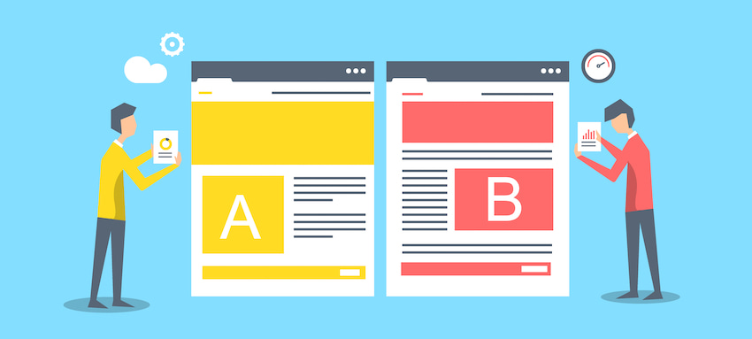
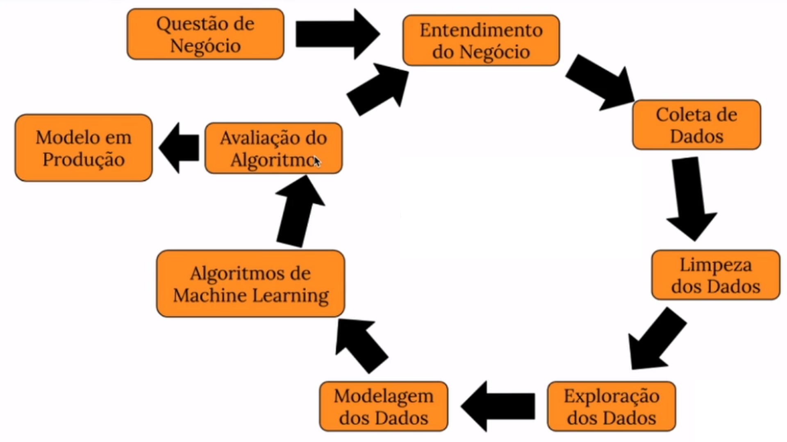
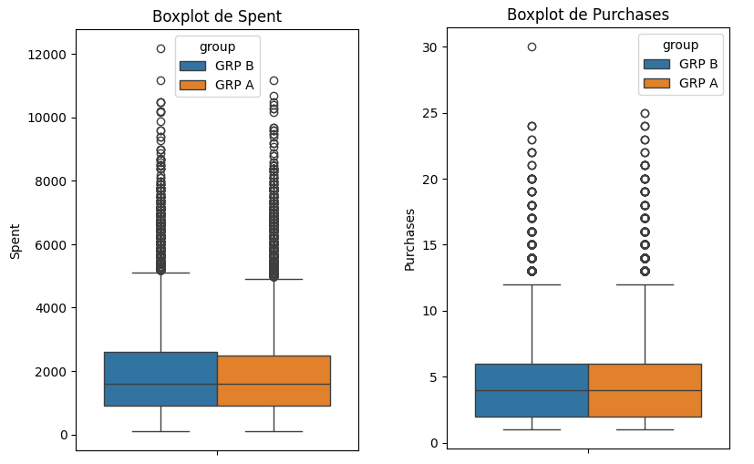
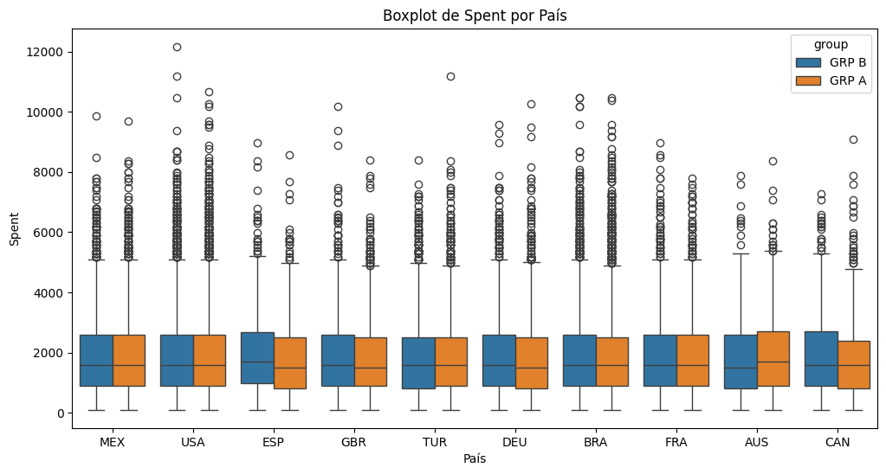
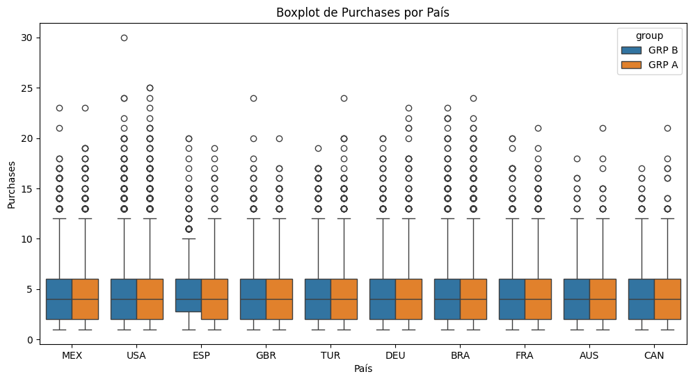
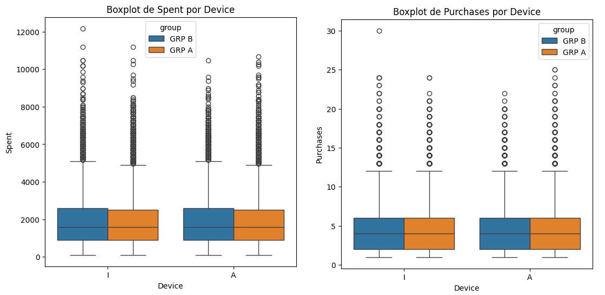
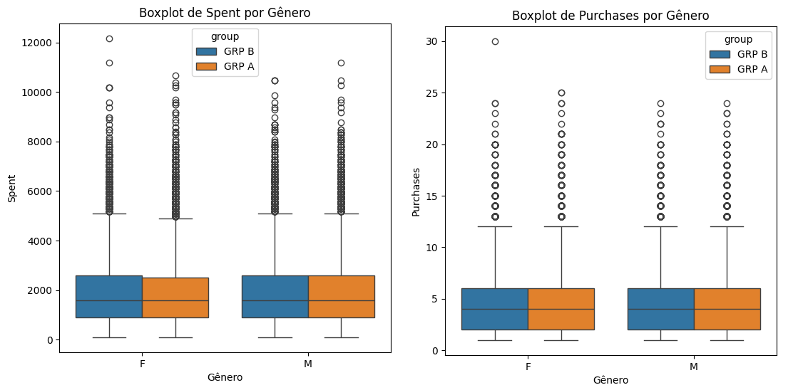

# Teste A/B - Métodos de Preenchimento

# Introdução

Esse é um projeto end-to-end de Data Science, focado na especilização com Teste A/B. No qual identificamos qual é o melhor método de preenchimento de formulário de dados do cartão de crédito, e mostramos a importância de aplicar esse tipo de teste e suas diferentes vertentes.

O conjunto de dados pode ser encontrado através desse link: [Repositório do Google Drive](https://drive.google.com/file/d/1oUJLeAgSaUI7CA-0F14KG0FzXEim7pSe/view)

Esse projeto faz parte da "Comunidade DS", que é um ambiente de estudo que promove o aprendizado, execução, e discussão de projetos de Data Science.

### Plano de Desenvolvimento do Projeto de Data Science

Esse projeto foi desenvolvido seguindo o método CRISP-DS(Cross-Industry Standard Process - Data Science). Essa é uma metodologia capaz de transformar os dados da empresa em conhecimento e informações que auxiliam na tomada de decisão. A metodologia CRISP-DM define o ciclo de vida do projeto, dividindo-as nas seguintes etapas:

- Entendimento do Problema de Negócio
- Coleção dos Dados
- Limpeza de Dados
- Análise Exploratória dos Dados
- Preparação dos Dados
- Modelos de Machine Learning.
- Avaliação dos Resultados do Modelo e Tradução para Negócio.
- Modelo em Produção

Observação: Como esse não é um projeto com uso de Machine Learning, os ciclos do CRISP-DM foram usados no contexto do Teste A/B.

### Planejamento

- [1. Descrição e Problema de Negócio](#1-descrição-e-problema-de-negócio)
- [2. Base de Dados e Premissas de Negócio](#2-base-de-dados-e-premissas-de-negócio)
- [3. Estratégia de Solução](#3-estratégia-de-solução)
- [4. Análise Exploratória de Dados](#4-análise-exploratória-de-dados)
- [5. Definição dos Parâmetros](#5-definição-dos-parâmetros)
- [6. Teste de Hipóteses](#6-teste-de-hipóteses)
- [7. Resultados de Negócio](#7-resultados-de-negócio)
- [8. Conclusão](#8-conclusão)
- [9. Aprendizados e Trabalhos Futuros](#9-aprendizados-e-trabalhos-futuros)

# 1. Descrição e Problema de Negócio

### 1.1 Descrição

A Electronic House é um comercio online ( e-commerce ) de produtos de informática para casas e escritórios. Os clientes podem comprar mouses, monitores, teclados, computadores, laptops, cabos HDMI, fones de ouvido, cameras webcam, entre outros, através de um site online e recebem os produtos no conforto de suas casas.

Os produtos não são vendidos somente no Brasil, a Eletronic House está presente em diversos países da Europa e da América do Norte. O Diretor de Produtos Global pediu ao Head de Design que desenvolvesse uma nova forma de finalizar a compra com cartão de crédito, sem a necessidade do cliente preencher manualmente todas as informações do cartão e que funcionasse em todos os países.

Depois de meses desenvolvendo esse dispositivo, o time de Desenvolvimento Backend entregou uma solução de pagamentos, na qual 90% das informações do formulário eram preenchido automaticamente.

O Head de Designer gostaria de medir a efetividade do novo dispositivo de preenchimento automático dos dados do cartão de crédito na página de vendas e reportar os resultados ao Diretor de Produtos Global, para concluir se a nova forma de pagamento é realmente melhor do que a antiga.

As duas páginas foram colocadas no ar e durante alguns meses e o time de Front-End desenvolveu uma automação que atribui um rótulo para cada cliente, mostrando qual a página de vendas aquele determinado cliente estava visualizando. Todos esses dados foram armazenados em um banco de dados e podem ser acessados pelos times da Electronic House.

### 1.2 Problema de Negócio

O papel do Cientista de Dados foi ajudar o time de Designers a validar a efetividade do novo meio de
pagamento, com mais confiança e rigidez na análise. E os entregáveis são:

**- Qual a melhor forma de pagamento: Preenchimento Manual ou Automático do formulário de dados do cartão de crédito?**

# 2. Base de Dados e Premissas de Negócio

## 2.1 Base de Dados

O conjunto de dados total possui os seguintes atributos:
| **Atributos** | **Descrição** |
| ------------------- | ------------------- |
| uid | Identificador do Usuário |
| country | Sigla do País que do usuário |
| gender | Gênero do Usuário |
| spent | Valor total gasto pelo usuário na compra |
| purchases | Total de compras do usuário no dia |
| date | Data da compra |
| group | Tipo de Preenchimento - A: Automático B: Manual |
| device | Meio de compra - I: Site A: App |

## 2.2 Premissas de Negócio

Para realizar esse projeto as seguintes premissas de negócio foram adotadas:

- É preciso garantir que não há usuários que usaram mais de um tipo de preenchimento no período.
- Há uma quantidade grande na população dos dados, para o teste iremos tirar uma amostra de acordo com os parâmetros definidos.
- A resposta da qual precisamos responder não nos define uma variável de sucesso. E entre os dados que temos há algumas features que podem assumir essa posto de métrica de sucesso. Dessa forma, foram usadas duas métricas para medição de sucesso desse problema, spent e purchases.
- As hipóteses de spent serão: 
  **H0 - A média de valor gasto do preenchimento automático é IGUAL ao do preenchimento manual (Hipótese Nula)** 
  **H1 - A média de valor gasto do preenchimento automático é DIFERENTE ao do preenchimento manual**
- As hipóteses de purchases serão: 
  **H0 - A média de compras do preenchimento automático é IGUAL ao do preenchimento manual (Hipótese Nula)** 
  **H1 - A média de compras do preenchimento automático é DIFERENTE ao do preenchimento manual**

# 3. Estratégia de Solução

A estratégia de solução foi a seguinte:

### Passo 01. Análise descritiva dos dados

Nesse passo foi verificado alguns aspectos do conjunto de dados, como: nome de colunas, dimensões, tipos de dados, checagem e preenchimento de dados faltantes (NA), análise descritiva dos dados e quais suas variáveis categóricas.

Além disso, testes de duplicidade das amostras foram feitos, e os usuários que estavam em mais de um grupo foram retirados, devido a quantidade de dados que temos inicialmente.

### Passo 02. Design do Experimento

Nesse momento as hipóteses foram formadas, os parâmetros foram definidos em com isso o tamanho da amostra foi encontrado.

### Passo 03. Exploration Data Analysis

Com o intuito de ter um feeling inicial dos dados, algumas distribuições foram plotadas, com isso conseguimos ver como estavam distribuídos os dados.

### Passo 04. Amostragem

Com o tamanho da amostra definido, foi possível selecionar as amostras de ambos os grupos de forma aleatória e preparar os dados para o teste.

### Passo 05. Teste de Hipóteses

A metodologia do teste de hipóteses foi aplicado, seguindo a lógica ensinado e o resultado encontrado.

### Passo 06. Resultados de Negócio

O teste de hipóteses foi automatizado e testado para diferentes valores de lift com o intuito de encontrar a resposta para a pergunta de negócio. Além disso, estratificações foram feitas, testes por país, gênero e device.

# 4. Análise Exploratória de Dados

Essa análise foi focada em entender como a métrica de sucesso está distribuída entre os grupos.

## 4.1 Geral

Tanto com spent como em purchases, vemos as distribuições dos dois grupos muito parecidas. Em spent temos o preenchimento automático com um valor um pouco menor nos Q3 e Q4.

Contudo, esses valores nos dão a primeira impressão de igualdade entre os valores dos grupos e que realmente somente um teste estatístico pode definir se um dos tipos é melhor que o outro.

## 4.2 Dividido por País

Essa igualdade se mantém ao analisarmos por país.

Em spent as distribuições são em ESP, DEU e AUS (Espanha, Alemanha e Austrália respectivamente). Dessa forma, na Espanha temos uma impressão do preenchimento automático ter funcionado melhor que o preenchimento manual, fazendo os usuário gastarem mais devido a isso.

O contrário pode ser dito para Austrália, com superioridade nos valores do preenchimento manual.

Em purchases apenas Espanha (ESP) mostra uma diferença na distribuição, e mesmo assim apenas nos valores do Q1.

## 4.3 Dividido por Device

Em purchases vemos uma distribuição praticamente igual entre os grupos e em ambos os devices. O cenário muda um pouco em spent, onde os valores do preenchimento automático perecem levemente menor que o do preenchimento manual.

## 4.4 Dividido por Gênero

Por gênero a diferença na distribuição é ainda menor, onde apenas para o gênero feminino em spent parece ter uma distribuição levemente mais baixa que para o preenchimento automático.

Isso pode nos mostrar uma pequena influência dessa feature no resultado do teste de hipóteses.

# 5. Definição dos Parâmetros

A seguir daremos definições dos parâmetros e quais valores foram usados.

## 5.1 Nível de Confiança

É a probabilidade de que o intervalo de confiança contenha o verdadeiro parâmetro da população. Nesse teste um valor padrão de **95%** foi utilizado.

## 5.2 Nível de Significância

Pode ser definido como a probabilidade de rejeitar a hipótese nula quando ela é verdadeira, denotada por α (alfa), é o inverso do nível de confiência. Nesse projeto o valor foi de **5%**

## 5.3 Tamanho do Efeito

Seria a magnitude da diferença entre grupos ou a força de uma relação entre variáveis, indicando a importância prática dos resultados. O tamanho do efeito nos diz que quando o efeito é facilmente detectável, o tamanho da amostra é menor, enquanto, quando o efeito é mínimo, é preciso de uma amostra bem maior para prová-lo.

Entretanto, isso não foi definido por quem solicitou o teste, dessa forma podemos alterar os tamanhos do efeito, com o intuito de buscar um resultado com êxito no teste de hipóteses (desde que haja amostrar o suficiente).

Assim, para definir esse valor primeiro definimos as métridas de spent e purchases, com isso, adicionamos um **lift de 1%, 5%, 10%, 15% e 20%**.

Com isso, o tamanho do efeito foi encontrado fazendo a **diferença entre o valor pós lift e antes do mesmo, sobre o desvio médio padrão do valor da população**.

## 5.4 Poder Estatístico

É probabilidade de detectar um efeito, se ele realmente existir, denotado por 1 - β (beta), onde β é a taxa de falso negativo. Nesse projeto o valor padrão de **80%** foi utilizado.

## 5.5 Tamanho da amostra

Com todos esse parâmetros encontramos o tamanho da amostra, que é a quantidade de observações ou indivíduos incluídos em um estudo ou experimento, essencial para garantir a validade e precisão dos resultados estatísticos.
Os valores foram encontrados para cada lift, e os valores que encontrarmos de conversão estarão representando toda a população, considerando um nível de confiância de 95%.

# 6. Teste de Hipóteses

Através da amostra encontrada, foram calculadas as médias das métricas de sucessos para cada amostra, mas apenas comparar esses resultados não é o suficiente para provar que um tipo de preenchimento é melhor que o outro.

Para isso faremos um teste de hipóteses, onde o intuito é rejeitar a hipótese nula, ou seja, que o preencimento automático tem uma média de spent ou purchases menor que a do preenchimento manual.

Assim, precisamos definir qual teste será usado, e para foi utilizado esse guia:

Através do diagrama utilizaremos o Two Sample t-test, para isso os teste de Parametric Assumption foram feitos. 

O resultado é um p-valor, onde se o p-valor for menor que o nível de significância, a hipótese nula é rejeitada, se for maior, significa que com esses dados não é possível rejeitar a hipótese nula. Assim apresentamos o resultado para diferentes lifts e métricas de sucesso:

| **Lift** | **Spent** | **Purchases** |
| ------------------- | ------------------- | ------------------- |
| 1%  | Amostras insuficientes | Amostras insuficientes |
| 5%  | Falha | Falha |
| 10% | A < B | Falha |
| 15% | Falha | Falha |
| 20% | Falha | Falha |

Com esse resultado, **não podemos rejeitar a hipótese nula na maioria dos testes**, com excessão ao de lift de 10%. Contudo, esse teste nos provou que a média de de valor gasto no preenchimento automático é **10% MENOR** que a do preenchimento manual.

Ou seja, a nova funcionalidade não só não superou a funcionalidade anterior, como obteve um desempenho pior na questão do valor gasto.

Como nossos dados iniciais apresentam features como país, gênero e device, podemos aprofundar a análise em cada uma delas, afim de levar não apenas o resultado final do teste, mas a conclusões um pouco mais aprofundadas.

## 6.1 Gênero

Os testes de hipótese nos gêneros confirmam a impressão da EDA. Essa **variável não foi influenciada pelo tipo de preenchimento**, e com os dados disponíveis não é possível provar que há uma diferenla estatística entre as métricas tanto de spent quanto de purchases entre os grupos.

| **Valor** | **Lift** | **Spent** | **Purchases** |
| ------------------- | ------------------- | ------------------- | ------------------- |
| Feminino | Todos  | Falha | Falha |
| Masculino | Todos  | Falha | Falha |

## 6.2 Device

Apesar de uma impressão inicial de que o preenchimento automático apresentava valores menores que o preenchimento manual, os **testes de hipótese no device nos mostram que essa feature também influencia pouco na performance dos preenchimentos**.

Onde com os dados disponíveis **não é possível provar que há uma diferença estatística** entre as métricas tanto de spent quanto de purchases entre os grupos.

| **Valor** | **Lift** | **Spent** | **Purchases** |
| ------------------- | ------------------- | ------------------- | ------------------- |
| Site | Todos  | Falha | Falha |
| App | Todos  | Falha | Falha |

## 6.3 País

Apesar da quantidade de países analisadas, não há diferenças estatísticas entre as médias da maioria deles.

Contudo, no México observamos que a média de de valor gasto no preenchimento automático é **10% MAIOR** que a do preenchimento manual, mostrando que a mudança foi efetiva para compras nesse país.

Em contrapartida Espanha apresenta valores estatisticamente **10% MENORES** em spent e purchases no preenchimento automático, evidenciando que a mudança não foi efetiva nesse país e que além disso, o resultado geral pode ser sido influenciado pelo resultado das pessoas desse país.

| **Valor** | **Lift** | **Spent** | **Purchases** |
| ------------------- | ------------------- | ------------------- | ------------------- |
| MEX | 10% | A > B | Falha |
| USA | Todos | Falha | Falha |
| ESP | 10% | A < B | A < B |
| GBR | Todos | Falha | Falha |
| TUR | Todos | Falha | Falha |
| DEU | Todos | Falha | Falha |
| BRA | Todos | Falha | Falha |
| FRA | Todos | Falha | Falha |
| AUS | Todos | Falha | Falha |
| CAN | Todos | Falha | Falha |

# 7. Resultados de Negócio

Respondendo as perguntas de negócio:

**Qual a melhor forma de pagamento: Preenchimento Manual ou Automático do formulário de dados do cartão de crédito?**

Através do teste de hipóteses podemos provar que apesar de uma boa ideia, o Preenchimento Manual continua sendo a melhor forma para preencher os dados de cartão de crédito. Observamos que a média de valor gasto com compras nesse tipo de preenchiemnto é 10% maior que a média do valor gasto no preenchimento manual.

Com isso, a hipótese é que esse novo tipo de preenchimento não foi bem recebido pelos usuários, para saber exatamento o motivo seria interessante fazer um teste de usuabilidade.

Além disso, descobrimos que variáveis como gênero e device não influenciam na média de valor gasto e de compras para ambos os tipos de preenchimento.

Por fim, em alguns lugares observamos uma preferência no tipo de preenchimento, como no México, que apresentou média de valor gasto 10% maior no preenchimento automático. Em contrapartida, na França de encontram os principais ofensores so novo tipo de preenchimento, onde a média de valor gasto de de compras é 10% menor no novo método.

# 8. Conclusão

Nesse projeto, foram realizadas todas as etapas necessárias para a implementação de um projeto completo de Data Science focado na utilização do Teste A/B. Foi utilizado o método de gerenciamento de projeto chamado CRISP-DM/DS e obteve-se um desempenho satisfatório em compreender a utilização do teste A/B e aplicar em um problema real.

Tendo em vista os resultados, o projeto alcançou seu objetivo de fazer o teste e provar para a empresa de forma estatística que o nov tipo de preenchimento não foi o esperado.

# 9. Aprendizados e Trabalhos Futuros

**Aprendizados**

- Compreensão e aplicação do Teste A/B com médias.
- Conceitos estatísticos e parâmetros com teste de hipóteses.

**Trabalhos Futuros**

- Aprofundar na análise do que influencia mais na compra ao invés do preenchimento do formulário.
- Aplicar os testes nos páises com divergências maiores, segregando ainda mais, como com device e gênero.
